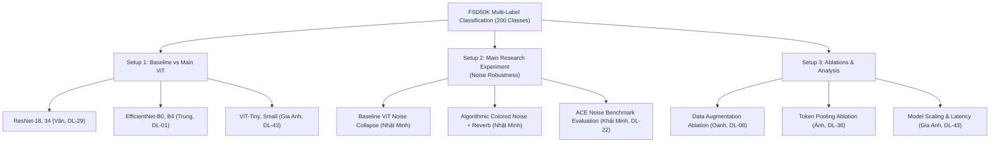

# Project Audit & Missing Requirements Checklist

**Project:** Environmental Sound Recognition Under Unseen Conditions  
**Deadline:** **8:00 AM, 7th October, 2026** (Submission by Group Leader via Google Classroom)  
**Reference Documents:** [`req.txt`](../req.txt), [`IntroDL - Trang tính1.csv`](../IntroDL%20-%20Trang%20t%C3%ADnh1.csv)

---

## 1. Compliance Audit Against Course Requirements

| # | Required Item (`req.txt`) | Requirement Specification | Current Project Status | Action Needed Before Deadline |
| :-: | :--- | :--- | :---: | :--- |
| **1** | **Report PDF** | 10–15 pages (excluding References & Appendix). Named `GroupID_ProjectID_Report.pdf` | ⚠️ **Template Created** ([`PROJECT_REPORT_TEMPLATE.md`](PROJECT_REPORT_TEMPLATE.md)) | Fill in quantitative values from experiments, export figures/tables, and compile to PDF (10–15 pages). Insert actual `GroupID` and `ProjectID`. |
| **2** | **GitHub Repository** | Complete code for preparation, training, evaluation, inference/demo. Named `DL2026-GroupID-ProjectID` | ⚠️ **Code Complete, Name Check Needed** | Ensure repository is public/accessible and renamed/aliased to `DL2026-GroupID-ProjectID`. |
| **3** | **README.md** | Complete README with installation instructions and steps to reproduce main experimental results | ✅ **Completed** ([`README.md`](../README.md)) | Verify that commands run out-of-the-box on a clean environment. |
| **4** | **DATA.md** | Official dataset URL, version, splits, preprocessing procedure, reproduction scripts, download links | ✅ **Completed** ([`DATA.md`](../DATA.md)) | Document FSD50K and ACE noise benchmark specifications. |
| **5** | **Member Contribution Table** | Mandatory table inside report detailing tasks, responsibilities, and contribution % of all 7 members | ✅ **Structured in Report** ([Section 8](PROJECT_REPORT_TEMPLATE.md#8-member-contribution-table)) | Confirm final percentage split with all 7 team members (currently set to 14.3% each). |
| **6** | **3-Minute Presentation Slides** | Exactly 4 slides:  1. Problem & RQ  2. Method & Experiments  3. Key Results  4. Conclusion / Demo | ⚠️ **Pending Slide Deck** | Create the 4-slide presentation deck using the structured slide outline provided below. Select 1 speaker. |
| **7** | **Inference / Demo** | Working script to demonstrate model predictions on novel audio clips | ✅ **Completed** ([`scripts/inference.py`](../scripts/inference.py)) | Test live during presentation demo (Slide 4). |

---

## 2. Experimental Setups & Task Completion Matrix

Based on [`IntroDL - Trang tính1.csv`](../IntroDL%20-%20Trang%20t%C3%ADnh1.csv) and git branches:

### Detailed Sub-Experiment Checklist:
1. **Setup 1 (Baselines vs. ViT):**
   * **ResNet-18 / ResNet-34 (Vân - DL-29):** Branch `exp/baseline-resnet`. Needs final validation numbers filled into Table 6.1 (Val mAP, mAUC, Micro/Macro F1, inference latency).
   * **EfficientNet-B0 / EfficientNet-B4 (Trung - DL-01, DL-02):** Branch `exp/pretrained-denoising-encoder`. Needs final numbers filled into Table 6.1.
   * **ViT-Tiny / ViT-Small (Gia Anh - DL-43):** Branch `exp/pretrained-vit-encoder-comparison`. Clean baseline mAP: 0.5066 (Tiny). ViT-Small numbers to fill.
2. **Setup 2 (Main Research Experiment - Noise Robustness):**
   * **Pre-augmentation degradation:** Baseline ViT-Tiny evaluated on 10,231 clips across Clean (0.5066), +10 dB (0.3671), +5 dB (0.3196), 0 dB (0.2628), -5 dB (0.2040).
   * **Post-augmentation robust model:** Currently training on Kaggle. Record final mAP numbers across all 5 SNR conditions and fill into Table 6.2.
3. **Setup 3 (Ablation Studies):**
   * **Augmentation Ablation (Oanh - DL-08):** Branch `experiment/augmentation`. Fill Table 6.3.1 for the 6 configurations (No aug, Time only, Freq only, SpecAugment, Mixup only, Full).
   * **Classification Pooling Ablation (Ánh - DL-36):** Branch `exp/classification`. Fill Table 6.3.2 comparing Dual-Token (0.5467) vs. GAP vs. GAP+Max vs. Attention Pooling.
   * **Model Scaling (Gia Anh - DL-43):** Fill Table 6.1 parameter counts, GMACs, and latency comparisons.

---

## 3. Explicit Missing Items to Complete Before Submission

> [!WARNING]
> The following items must be explicitly handled by team members to satisfy all grading rubrics:

1. **Error Cases & Root-Cause Analysis (Mandatory in Report):**
   * `req.txt` explicitly emphasizes: *"Reporting results without interpretation is not sufficient. Report error cases. Analysis the reasons."*
   * **Action:** Pick 3 specific failure examples from the evaluation run:
     * One low-energy event masked by noise (e.g. `Coin_dropping` or `Click` at 0 dB SNR).
     * One harmonic confusion between similar classes (e.g. `Acoustic_guitar` vs `Plucked_string_instrument`).
     * One ambient sound confused with background colored noise (e.g. `Wind` or `Stream`).
   * Include their spectrograms in Figure 3 of the report.
2. **Official GroupID & ProjectID:**
   * Ensure the PDF is named strictly `GroupID_ProjectID_Report.pdf` (e.g. `G05_PRJ02_Report.pdf`).
   * Ensure repository name conforms to `DL2026-GroupID-ProjectID`.
3. **Merge Completed Branches to Main:**
   * After gathering validation results from `exp/baseline-resnet`, `exp/classification`, `experiment/augmentation`, merge them or document their commit hashes cleanly in the report appendix.

---

## 4. 4-Slide Presentation Template (3-Minute Overview)

Prepare a 4-slide presentation deck as strictly specified in `req.txt`:

* **Slide 1: Problem & Research Question**
  * Title: Robust Environmental Sound Recognition Under Unseen Acoustic Corruptions.
  * Context: FSD50K multi-label sound event classification (200 classes).
  * Research Questions: Why do state-of-the-art transformers collapse under real-world noise (0.5066 $\rightarrow$ 0.2040 mAP)? Can algorithmic DSP augmentations resolve this without external datasets?
* **Slide 2: Method & Experiments**
  * Architecture: Audio Spectrogram Transformer (AST) with DeiT ViT backbones vs. CNN baselines (ResNet, EfficientNet).
  * Method: Pure DSP Continuous Colored Noise ($1/f^\alpha$) and Schroeder Reverberation data augmentation.
  * Three Setups: (1) CNN vs ViT, (2) Noise Robustness (+10 dB to -5 dB SNR), (3) Augmentation & Token Pooling Ablations.
* **Slide 3: Key Results**
  * Setup 1 Summary: ViT achieves superior mAP and parameter efficiency compared to CNN baselines.
  * Setup 2 Summary: Proposed robust training preserves high mAP under heavy noise corruption compared to baseline collapse.
  * Setup 3 Summary: Dual-token pooling and combined SpecAugment+Mixup provide optimal representation and regularization.
* **Slide 4: Conclusion & Demo**
  * Key takeaway: Robustness can be achieved purely via physical DSP modeling without massive noise datasets.
  * Live/Recorded Demo: Running `scripts/inference.py` on a noisy audio clip showing real-time Top-5 multi-label predictions.
